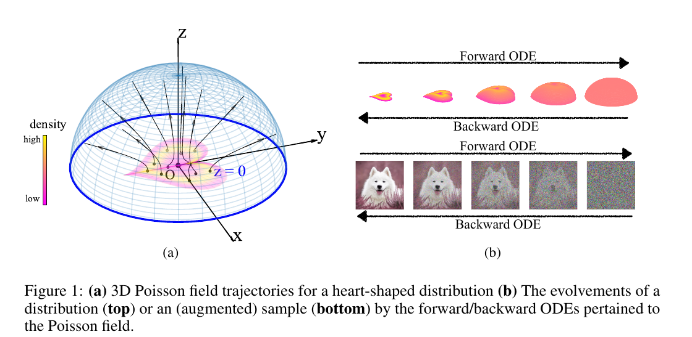
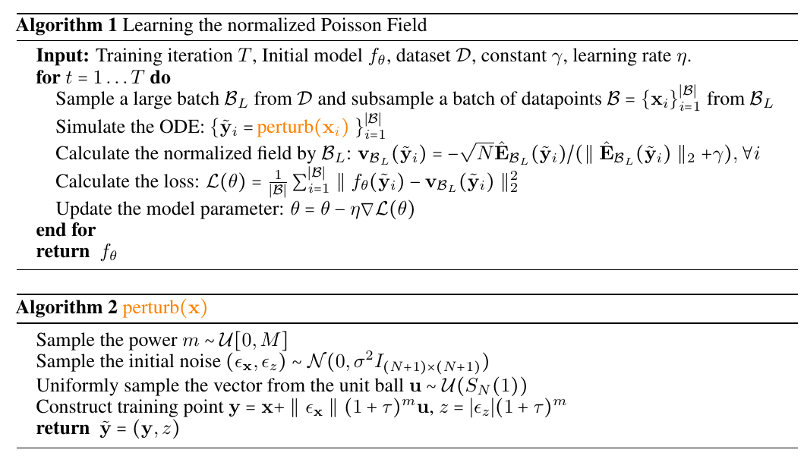
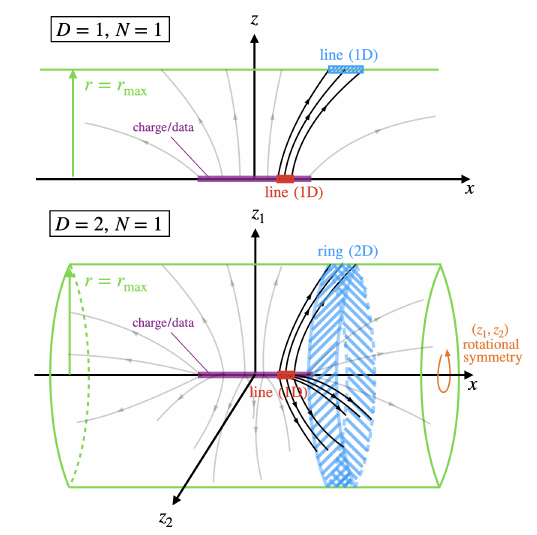
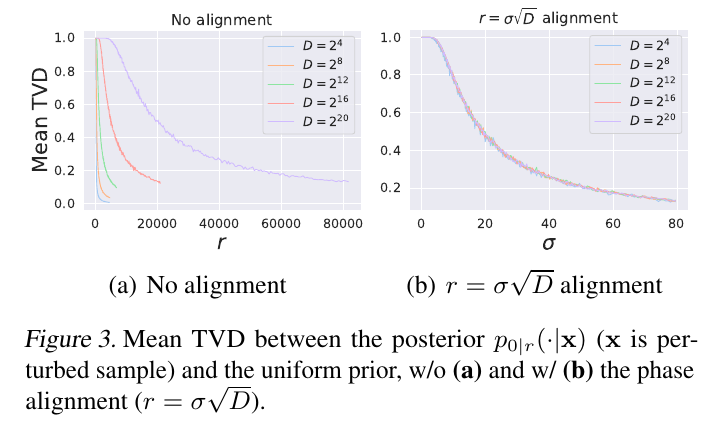
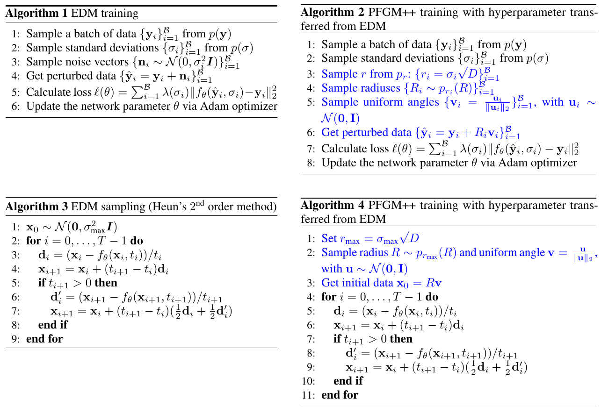
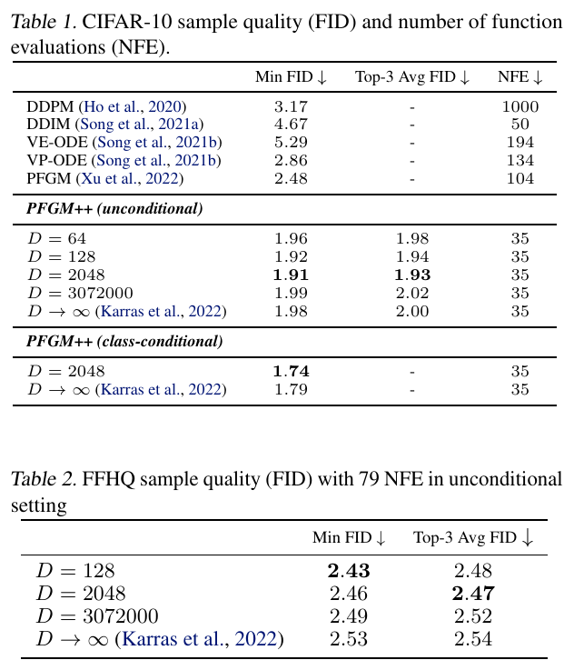

# EAI Diffusion Reading Group
## PFGM++: Unlocking the Potential of Physics-Inspired Generative Models
22/04/23

---
# Summary

1. PFGM recap
2. PFGM++ derivation
3. Properties
4. Results

---

# PFGM recap

---
# PFGM Recap

- Augment data set with additional dimension: $\tilde{\text{x}} = (\text{x}, z)$
- dataset embedded in $z=0$ hyperplane
- Learn (normalized) Poisson Field 
$$ E(\tilde{\text{x}}) = \frac{1}{S_N(1)} \int \frac{\tilde{\text{x}} - \tilde{\text{y}}}{\| \tilde{\text{x}} - \tilde{\text{y}} \|^{N+1}} d\text{y} $$
- Forward Process $d\tilde{\text{x}} = E(\tilde{\text{x}})dt$ : maps data distribution $p$ to uniform distribution on $N+1$ dimensional hemisphere

---

# PFGM training

---
# Problems with PFGM

Training procedure is suboptimal

- Need large batch to approximate Poisson field
- Minimizer is biased estimator of true field
- Not compatible with paired sample training (conditional generation)

---
# PFGM++ overview

1. Generalize by adding $D$ new dimensions
2. Immediately throw them away. $D$ is just a real-valued hyperparam
3. Use perturbation based objective (inspired by denoising score matching)
4. Profit?

---
# Notations
- $\text{x}, \text{y} \in \mathbb{R}^N$ : unaugmented datapoints
- $p(\text{y})$ data distribution
- $\tilde{\text{x}} = (\text{x},z)$ : augmented datapoint
- $S_N(1)$ volume of $N$-dimensional unit hypersphere

---
# Adding $D$ new dimensions, ...

New $N+D$ dimensional electric field
$$ E(\tilde{\text{x}}) = \frac{1}{S_{N+D-1}(1)} \int \frac{\tilde{\text{x}} - \tilde{\text{y}}}{\| \tilde{\text{x}} - \tilde{\text{y}} \|^{N+D}} d\text{y} $$

Defines a *surjection* between data distribution on $N+D$-dim hyperplane $\text{z}=0$ and uniform distribution on $N+D$-dim hemisphere.

---

# Or NOT!

Only one effective dimension needed $r(\tilde{\text{x}}) =\|\text{z}\|_2$. The field $E$ is invariant under $SO(D)$ symmetries (rotations)

---
# The actual augmentation

- $\tilde{\text{x}} = (\text{x}, r)$
- $$ \frac{dr}{dt} = \frac{1}{S_{N+D-1}(1)} \int \frac{r}{\| \tilde{\text{x}} - \tilde{\text{y}} \|^{N+D}} p(\text{y}) d\text{y} \equiv E(\tilde{x})_r $$
- Forward process ODE
$$ \frac{d\text{x}}{dr} = \frac{E(\tilde{\text{x}})_\text{x}}{E(\tilde{x})_r} $$

---
# Perturbation based objective

Old objective:
$$ \mathbb{E}_{\tilde{p}_{\text{train}}} \mathbb{E}_{\{\text{y}_i\}_{i=1}^n \sim p^n(\text{y})} \mathbb{E}_{\text{x} \sim p_\sigma (\text{x} | \text{y}_1)} \left[ \left\| f_\theta(\tilde{\text{x}}) - \frac{\sum_{i=1}^{n-1} \frac{\tilde{\text{x}} - \tilde{\text{y}}_i}{\| \tilde{\text{x}} - \tilde{\text{y}}_i\|^{N+D}}}{ \left\| \sum_{i=1}^{n-1} \frac{\tilde{\text{x}} - \tilde{\text{y}}_i}{\| \tilde{\text{x}} - \tilde{\text{y}}_i\|^{N+D}} \right\|_2 + \gamma} \right\|_2^2 \right] $$

New objective:
$$ \mathbb{E}_{r \sim p(r)} \mathbb{E}_{p(\text{y})} \mathbb{E}_{ \textcolor{#d88e1e}{p_r(\text{x}|\text{y})}} \left[\left\| f_\theta (\tilde{\text{x}}) - \frac{\tilde{\text{x}} - \tilde{\text{y}}}{r/\sqrt{D}} \right\|^2_2\right] $$

- $\tilde{\text{y}}=(\text{y},0)$, $\tilde{\text{x}}=(\text{x},r)$
- perturbation kernel $\textcolor{#d88e1e}{p_r(\text{x} | \text{y})} \propto 1/(\|\text{x}-\text{y}\|^2_2 + r^2)^{\frac{N+D}{2}} = p_r(R) \mathcal{U}_\psi(\psi)$
- $p_r(R) \propto \frac{R^{N-1}}{(R^2+r^2)^{\frac{N+D}{2}}}$

---
# $D \rightarrow \infty \Leftrightarrow$ Diffusion Models

$$ \lim_{\substack{D \rightarrow \infty \\ r=\sigma\sqrt{D}}} \left\| \frac{\sqrt{D}}{E(\tilde{\text{x}})_r} E(\tilde{\text{x}})_\text{x} - \sigma \nabla_\text{x} \log p_{\sigma=r/\sqrt{D}}(\text{x}) \right\| $$

Moreover, the training process are equivalent.

---

# Hyperparameter transfer to finite $D$

---

---

# Results

---
# Results summary

- Finite $D$ values outperform Diffusion Models (reaches SOTA)
- Sweet spot: $D=2048$ (CIFAR-10), $D=128$ (FFHQ)

---
# Conclusions

- Fixes most problems with PFGM
- Hyperparam $D$ as a continuum between PFGM ($D=1$) and Diffusion $D=\infty$
- Free Hyperparam transfer from Diffusion Models
