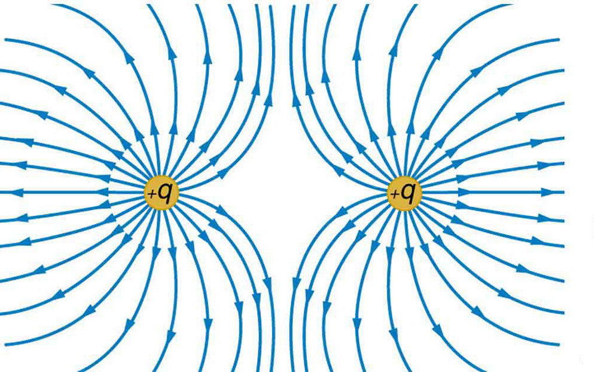
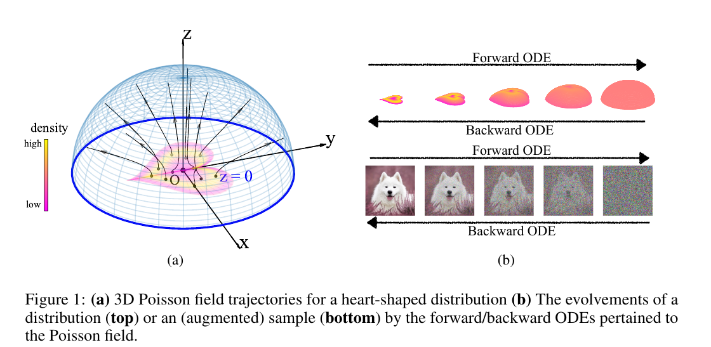
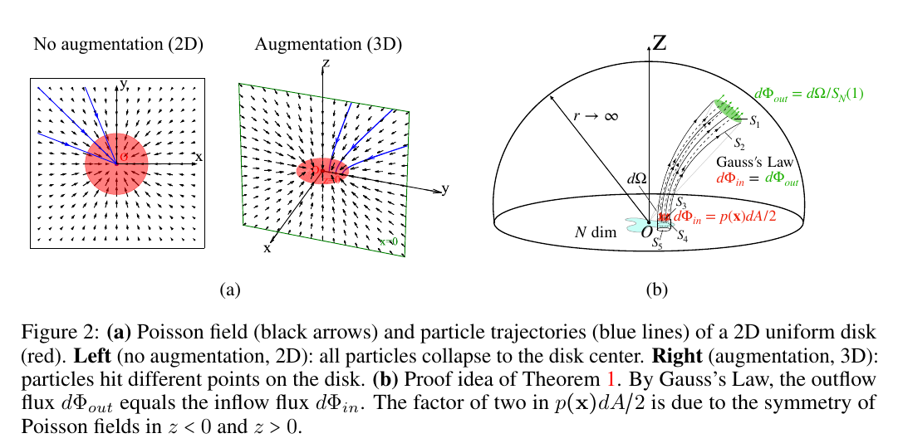
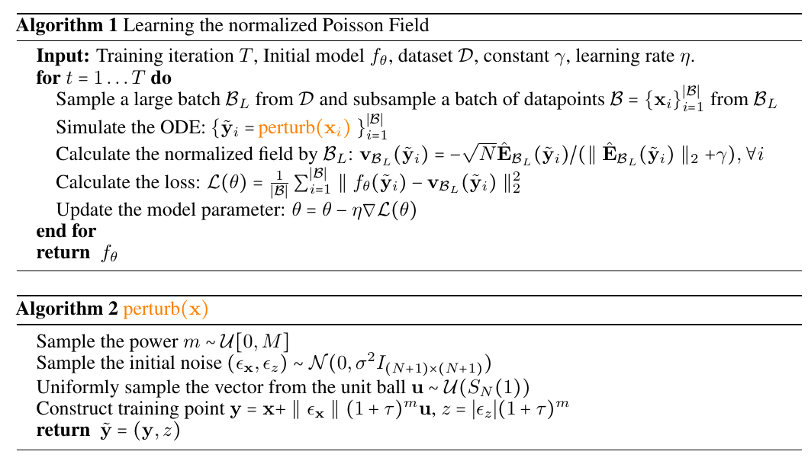
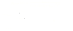
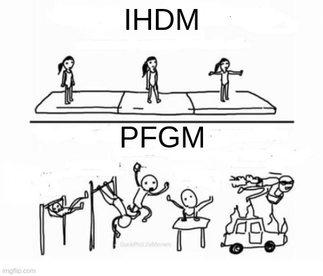
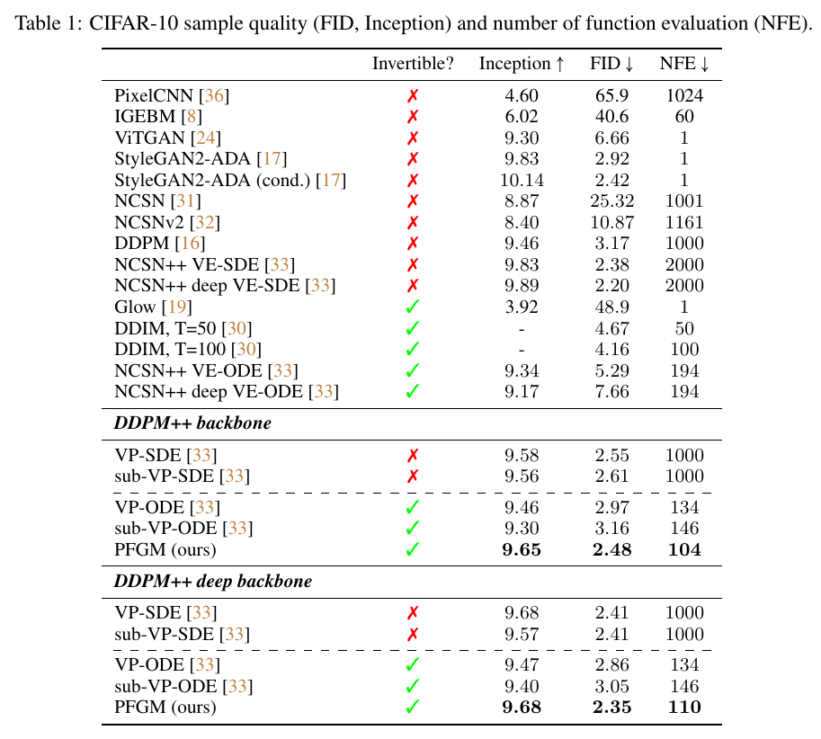
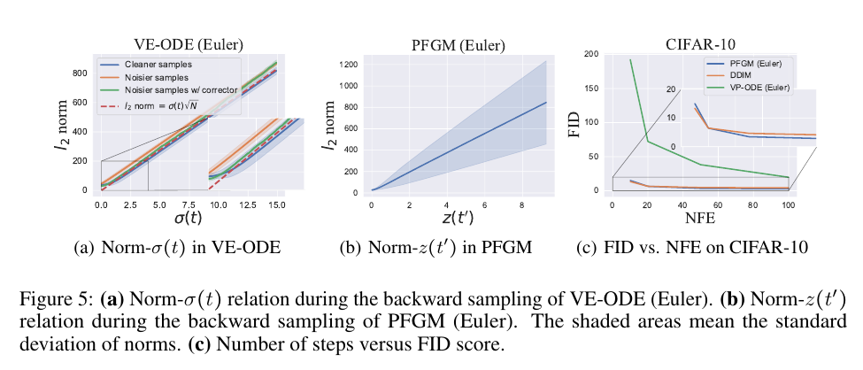

# EAI Diffusion Reading Group
## Poisson Field Generative Models
01/04/2023

---
# Summary

1. The Poisson Equation
2. PFGM Derivation
3. Results
4. PFGM++

---
# The Poisson Equation

Given some *source* density $\rho : \mathbb{R}^N \rightarrow \mathbb{R}$ (with *compact support* \*)

$$ \Delta \varphi = -\rho $$

- $\Delta  = \sum_{\mu=1}^N \frac{\partial^2}{\partial x_\mu^2}$ Laplacian operator (again!)
- Poisson Field $E(x) = -\nabla \varphi(x)$ satisfies *Gauss' Law*
$$ \nabla \cdot E = \rho $$

One of the most basic PDEs in physics (yields Newtonian gravity, Electrostatic theory, ...)

\* $\rho$ is zero outside of some bounded set

---
# Analytical solution
Given by *Green's function*
$$ \varphi(x) = \int G(x,y)\rho(y) dy $$

- $G(x,y) = \frac{1}{(N-2)S_{N-1}} \frac{1}{\| x-y \|^{N-2}}$ (Green's function: solution for a single point source)
- $$E(x) = - \int \nabla_x G(x,y) \rho(y)dy$$
- $\nabla_x G(x,y) = \frac{1}{S_{N-1}} \frac{x-y}{\| x-y \|^{N}}$

---
# Gradient Flow
Consider a charged particle dropped in the field $E$, its trajectory is given by
$$ \frac{dx}{dt} = E(x) $$

For a distribution of particles:
$$ \frac{\partial p_t}{\partial t}(x) = -\nabla \cdot (p_t(x) E(x)) $$

---

# Field Effects

Finally putting the "consciousness" in large Neural Nets

---
# Rescalable dynamics
The Gradient flow ODE is stiff :(. Luckily, for $f \in \mathcal{C}^1$, strictly positive

$$ \frac{dx}{dt} = \pm f(x) E(x) $$

follows the same trajectories as the original gradient flow

---

# Forward Process

---
# From the Physics to the actual forward process

Several steps needed
1. Add extra dimension $z$ (avoid mode collapse)
2. Normalize field $E$ (numerical stability)
3. Replace time with $z$ (for easier batching)

---

# Add extra dimension

---
# Add extra dimension
- Instead of solving the Poisson equation $\Delta \varphi = -p$ in $\mathbb{R}^N$, solve in augmented space $\tilde{x} = (x,z) \in \mathbb{R}^{N+1}$
- Embed original data with $x \mapsto (x,0)$

---
# Asymptotics as $\|x\| \rightarrow \infty$ 

Since $p$ has bounded support, as $x$ follows $\frac{dx}{dt} = E(x)$, $E$ becomes spherically symmetric

This means that for a sufficiently large radius $r$, the distribution $p_t$ is effectively uniform on the hemi-sphere of radius $r$

---
# Normalize $E$

Given a dataset $\mathcal{D} = \{ x_i \}_{i=1}^n$, the empirical Poisson field is
$$ \hat{E}(\tilde{x}) = c(\tilde{x}) \sum_{i=1}^n \frac{\tilde{x} - \tilde{x_i}}{\|\tilde{x} - \tilde{x_i} \|^{N+1}} $$
where $c(\tilde{x}) = 1/\sum_{i=1}^n \frac{1}{\|\tilde{x} - \tilde{x_i} \|^{N+1}}$

Further normalization yields the *negative normalized field*
$$ v(\tilde{x}) = -\frac{\sqrt{N} \hat{E}(\tilde{x})}{\| \hat{E}(\tilde{x})\| + \gamma} $$

Notation: fields calculated from batch $\mathcal{B}$: $\hat{E}_\mathcal{B}$, $v_\mathcal{B}$

NB: $\gamma$: small constant to avoid division by zero

---
# Perturbing the augmented training data
Given training datapoint $x \in \mathbb{R}^N$, add noise to $\tilde{x} = (x,0)$ to obtain $(y,z)$ :
$$ y = x + \|\epsilon_x\| (1+\textcolor{#e2b84d}\tau)^m u, \quad z = |\epsilon_z| (1+\textcolor{#e2b84d}\tau)^m $$
- $\epsilon = (\epsilon_x,\epsilon_z) \sim \mathcal{N}(0, \textcolor{#e2b84d}\sigma^2 I)$
- $u \sim \mathcal{U}(S_N)$
- $m \sim \mathcal{U}[0,\textcolor{#e2b84d}M]$

Hyperparameters: $\textcolor{#e2b84d}\tau$, $\textcolor{#e2b84d}\sigma$, $\textcolor{#e2b84d}M$

---
# Loss

Given mini-batch data $\mathcal{B} = \{x_i\}_{i=1}^{|\mathcal{B}|}$ and a larger batch $\mathcal{B}_L$ (for estimating the normalized field), we train a network $f_\theta$ to minimize

$$ \mathcal{L}(\theta) = \frac{1}{|\mathcal{B}|} \sum_{i=1}^{|\mathcal{B}|} \| f_\theta(\tilde{y}_i) - v_{\mathcal{B}_L} (\tilde{y}_i) \|^2_2 $$

---

# Training Algorithms

---
# Backward ODE

Instead of solving backward ODE in time, solve the equivalent ODE in $z$:
$$ \frac{d(x,z)}{dz} = (\frac{dx}{dt}\frac{dt}{dz}, 1) = (v(\tilde{x})_x v(\tilde{x})^{-1}_z, 1) $$

Start from some $z \le z_\max$, end at $z=0$

---

# Map hemisphere to $z=z_\max$ hyperplane
To allow processing batches, map the prior on the hemisphere $r=z_\max$ to the hyperplane

In practice: sample on hemisphere and project.

---
# The actual Backward ODE for real

Add new time variable such that $dz = zdt'$

$$ \frac{d(x,z)}{dt'} = (v(\tilde{x})_x v(\tilde{x})^{-1}_z z, z) $$

$z$ now converges exponentially towards $0$ in the backward ODE (actually makes solving the ODE faster)

---

---

# Results

---
# Results Summary

- Achieves best Inception and FID scores among normalizing flow models
- (10x ~ 20x) Faster than SDE models with similar architectures

---

# Euler method with low step size

---
# Miscelaneous

- Likelihood evaluation
- Latent representation

---
# Limitations

- The mini-batch normalized field estimator is biased
- need large training batch to compensate

These are fixed in PFGM++

---
# PFGM++

- Generalize to $z\in \mathbb{R}^D$
- equivalent to Diffusion models for $D\rightarrow \infty$
- Dispenses with the biased normalized field estimator
- No need to actually solve with the $D$ additional dimensions. One is enough
- Transfer Hyperparameters from Diffusion Models to arbitrary $D$